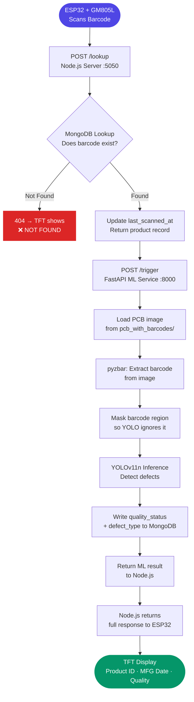

# 📦 TRACE — Smart Automated System for Product Labeling and Traceability


> **An ESP32-based IoT system that scans product barcodes and runs real-time AI defect detection on PCBs, logging results to a live traceability dashboard.**

---

## 📌 Table of Contents

- [The Problem](#-the-problem)
- [Our Solution & Purpose](#-our-solution--purpose)
- [Why This Over Others](#-why-this-over-others)
- [Tech Stack](#-tech-stack)
- [System Flow](#-system-flow)
- [File Structure](#-file-structure)
- [Prerequisites](#-prerequisites)
- [Installation & Setup](#-installation--setup)
- [Usage](#-usage)
- [Configuration](#-configuration)
- [Screenshots](#-screenshots)
- [Contribution Guidelines](#-contribution-guidelines)
- [Known Limitations & Roadmap](#-known-limitations--roadmap)
- [License](#-license)

---

## 🚨 The Problem

Manufacturing facilities that produce printed circuit boards (PCBs) rely heavily on manual visual inspection to catch defects — a process that is slow, inconsistent, and impossible to scale without significant labour cost. When a defective product slips through, there is often no automated audit trail linking the defect back to the specific batch, operator, shift, or production line that produced it.

**Key pain points:**

- ⚠️ **No traceability** — defective products cannot be reliably traced back to their manufacturing context (batch, shift, operator, location)
- ⚠️ **Manual inspection is inconsistent** — human inspectors miss defects under fatigue and cannot maintain throughput at scale
- ⚠️ **Inspection and record-keeping are disconnected** — quality results are not automatically written back to the product's database record in real time
- ⚠️ **No immediate on-line feedback** — operators on the production floor have no instant signal when a defective product is scanned

---

## 🎯 Our Solution & Purpose

**TRACE** *(Traceability, Real-time Analysis and Classification Engine)* is an end-to-end IoT and AI pipeline that authenticates products via barcode scan and immediately runs AI-powered defect detection on the associated PCB image, writing the quality result back to a live traceability database and displaying it on the scanning station in real time.

It solves the above by:

1. **Unified scan-to-result pipeline** — a single barcode scan triggers product verification, AI inspection, database logging, and operator display without any manual steps in between
2. **YOLOv11n defect detection** — a model trained on seven PCB defect classes (missing holes, mouse bites, open circuits, shorts, spurs, spurious copper, background) with >95% precision and >85% mAP@0.5
3. **Permanent audit trail** — every scan updates the product record in MongoDB with quality status, defect type, and timestamp, creating a traceable history per barcode

---

## ⚡ Why This Over Others

| Feature | TRACE | Manual Inspection | Commercial Vision Systems (Cognex / Keyence) | Generic YOLOv8 Repos |
|---|:---:|:---:|:---:|:---:|
| Real-time defect detection | ✅ | ❌ | ✅ | ✅ |
| Barcode-linked traceability | ✅ | ❌ | ✅ | ❌ |
| End-to-end automated pipeline | ✅ | ❌ | ✅ | ❌ |
| On-device display feedback (TFT) | ✅ | ❌ | ❌ | ❌ |
| Live monitoring dashboard | ✅ | ❌ | ✅ | ❌ |
| Low-cost hardware (ESP32-based) | ✅ | ✅ | ❌ | ✅ |
| Open source | ✅ | — | ❌ | ✅ |
| Offline capable | ✅ | ✅ | ❌ | ✅ |

> 💡 **The bottom line:** This is the only open-source solution that combines barcode-based product authentication, AI defect detection, database traceability, and real-time operator feedback in a single low-cost hardware pipeline.

---

## 🛠 Tech Stack

### Hardware / Embedded

| Technology | Purpose |
|---|---|
| ESP32-WROOM-32 | Primary microcontroller — WiFi, serial communication, display control |
| GM805L Barcode Scanner | EAN-13 barcode reading via Serial2 (GPIO 16/17) |
| TFT Display (SPI) | Real-time result display for operators on the production floor |
| Arduino IDE 2.x | Firmware development and flashing |

### Backend

| Technology | Version | Purpose |
|---|---|---|
| Node.js | 20.x | Runtime environment |
| Express | 5.x | REST API framework |
| Mongoose | 8.x | MongoDB ODM and schema management |
| Axios | 1.x | HTTP client for ML API communication |
| dotenv | 16.x | Environment variable management |

### ML Service

| Technology | Version | Purpose |
|---|---|---|
| Python | 3.10+ | Runtime environment |
| FastAPI | Latest | REST API framework for the ML service |
| Uvicorn | Latest | ASGI server |
| Ultralytics YOLOv11n | Latest | PCB defect detection model |
| OpenCV | Latest | Image preprocessing and masking |
| pyzbar + Pillow | Latest | Barcode extraction from product images |
| Streamlit | Latest | Live monitoring dashboard |

### Database

| Technology | Version | Purpose |
|---|---|---|
| MongoDB | 6.x | Primary database — product records, scan history, quality results |

---

## 🔄 System Flow




### Flow Explanation

| Step | Description |
|---|---|
| **Barcode Scan** | GM805L reads an EAN-13 barcode and sends it to the ESP32 via Serial2. ESP32 extracts the 13-digit code and sends a POST request to the Node.js server over WiFi. |
| **DB Lookup** | Node.js queries MongoDB for the scanned barcode. If not found, a 404 is returned immediately and the TFT shows NOT FOUND. |
| **Record Update** | On a match, `last_scanned_at` is updated and the product's `product_id` is forwarded to the ML service. |
| **Image Load** | FastAPI searches `pcb_with_barcodes/` for the image matching `*_{product_id}.png`. |
| **Barcode Extraction** | pyzbar extracts the barcode string from the image for cross-verification. |
| **Masking** | The barcode region is white-filled so YOLO does not confuse barcode lines for PCB defects. |
| **Defect Detection** | YOLOv11n runs inference at conf=0.25. Each detected box returns a class name and confidence score. |
| **DB Write** | `quality_status` (defective / no_defect) and `defect_type` are written back to the product record in MongoDB. |
| **Display** | The full result travels back through Node.js to the ESP32 and is rendered on the TFT screen for the operator. |

---

## 📁 File Structure

```
TRACE/
│
├── ASSETS/                             # Project images and diagrams
│   ├── FLOW MAP.jpeg                   # End-to-end system flow diagram
│   ├── CONFUSION MATRIX.jpeg           # Model evaluation — per-class accuracy
│   ├── TRAINING RESULTS.jpeg           # Loss and metric curves across 100 epochs
│   └── TEST OUTPUT.jpeg                # Side-by-side defect detection predictions
│
├── data/
│   └── pcb_traceability_labeled_dataset.csv   # 1000+ product records for DB seeding
│
├── firmware/
│   ├── Barcode Scanner.ino             # ESP32 firmware — scan, send, display
│   └── config.h                        # WiFi credentials and server URL (not committed)
│
├── ml/
│   ├── api.py                          # FastAPI entry point — orchestrates the pipeline
│   ├── requirements.txt                # All Python dependencies
│   ├── .env.example                    # ML service environment variable template
│   │
│   ├── core/
│   │   ├── image_utils.py              # Image loading and resizing
│   │   ├── barcode.py                  # pyzbar extraction and barcode masking
│   │   └── detector.py                 # YOLOv11n inference + auto-download of weights
│   │
│   ├── db/
│   │   └── mongo.py                    # All MongoDB write operations
│   │
│   ├── dashboard/
│   │   └── live.py                     # Streamlit real-time monitoring dashboard
│   │
│   └── models/
│       └── best.pt                     # YOLOv11n weights (gitignored — auto-downloaded)
│
├── server/
│   ├── server.js                       # Express app entry point
│   ├── seed.js                         # Seeds MongoDB from the CSV dataset
│   ├── package.json
│   ├── .env.example                    # Server environment variable template
│   │
│   ├── config/
│   │   └── db.js                       # MongoDB connection
│   │
│   ├── models/
│   │   └── barcode.js                  # Mongoose schema for product records
│   │
│   ├── routes/
│   │   └── lookup.js                   # POST /lookup route definition
│   │
│   └── controllers/
│       └── barcodeController.js        # Lookup + ML trigger business logic
│
├── .gitignore
├── LICENSE
└── README.md
```

---

## 🧰 Prerequisites

Ensure the following are installed before proceeding:

| Requirement | Minimum Version | Check Command | Download |
|---|---|---|---|
| Node.js | v20.x | `node -v` | [nodejs.org](https://nodejs.org) |
| npm | v9.x | `npm -v` | Bundled with Node |
| Python | 3.10+ | `python --version` | [python.org](https://python.org) |
| pip | 23.x | `pip --version` | Bundled with Python |
| MongoDB | 6.x | `mongod --version` | [mongodb.com](https://www.mongodb.com/try/download/community) |
| Arduino IDE | 2.x | — | [arduino.cc](https://www.arduino.cc/en/software) |
| Git | 2.x | `git --version` | [git-scm.com](https://git-scm.com) |

> ⚠️ **OS Compatibility:** Tested on macOS 14+ and Ubuntu 22.04+. Windows is supported via WSL2.

### Arduino Board & Library Setup

In Arduino IDE, install the following before flashing:

| Library / Board | Install via |
|---|---|
| ESP32 board support | Boards Manager → search `esp32` by Espressif |
| TFT_eSPI | Library Manager → search `TFT_eSPI` by Bodmer |
| ArduinoJson | Library Manager → search `ArduinoJson` by Benoit Blanchon |

### Hardware Wiring

#### GM805L Barcode Scanner → ESP32

| Wire Color | Function | ESP32 Pin |
|---|---|---|
| Red | VCC | 3.3V |
| White | GND | GND |
| Blue | TX (Data Out) | GPIO16 (RX2) |
| Green | RX (Data In) | GPIO17 (TX2) |

#### TFT Display → ESP32 (SPI)

| TFT Pin | Function | ESP32 Pin |
|---|---|---|
| GND | Ground | GND |
| VCC | Power | 3.3V |
| SCL | SPI Clock | GPIO18 |
| SDA | SPI Data (MOSI) | GPIO23 |
| RES | Reset | GPIO4 |
| DC | Data/Command | GPIO2 |
| BLK | Backlight | 3.3V (always-on) or GPIO (PWM) |

---

## 🚀 Installation & Setup

### 1. Clone the Repository

```bash
git clone https://github.com/MNADITYA05/TRACE.git
cd TRACE
```

### 2. Configure the Server

```bash
cd server
cp .env.example .env        # Fill in MONGO_URI, PORT, ML_API_URL
npm install
```

### 3. Seed the Database

```bash
# Inside server/
npm run seed
```

This imports all product records from `data/pcb_traceability_labeled_dataset.csv` into MongoDB.

### 4. Configure and Start the ML Service

```bash
cd ../ml
cp .env.example .env        # Fill in MONGO_URI, IMAGE_DIR, MODEL_PATH
pip install -r requirements.txt
uvicorn api:app --host 0.0.0.0 --port 8000
```

On first run, `detector.py` will automatically download `best.pt` from GitHub Releases if it is not present locally.

### 5. Start the Node.js Server

```bash
cd ../server
npm start
```

### 6. Flash the Firmware

Open `firmware/Barcode Scanner.ino` in Arduino IDE. Edit `firmware/config.h` with your WiFi credentials and server IP, then upload to the ESP32.

```cpp
#define WIFI_SSID     "your-wifi-name"
#define WIFI_PASSWORD "your-wifi-password"
#define BACKEND_URL   "http://<your-server-ip>:5050/lookup"
```

### 7. Verify the Setup

```
✅ MongoDB running on port 27017
✅ ML service running at http://localhost:8000
✅ Node.js server running at http://localhost:5050
✅ ESP32 connected to WiFi — IP shown on TFT display
```

---

## 💡 Usage

### Scan a Product

Point the GM805L scanner at any EAN-13 barcode on a seeded product. The TFT display will show the result within seconds.

**Matched product — no defect:**
```
✅ MATCHED
Product: AABAN010625001
MFG: 01-06-2025
Barcode: 1120106250013
Quality: no_defect
```

**Matched product — defective:**
```
✅ MATCHED
Product: AABAN010625001
MFG: 01-06-2025
Barcode: 1120106250013
Quality: defective
```

**Unknown barcode:**
```
❌ NOT FOUND
```

### Start the Live Dashboard

```bash
cd ml
streamlit run dashboard/live.py
```

Opens at `http://localhost:8501` — filter by shift, quality status, or defect type across all scanned records.

### Common Commands

| Command | Location | Description |
|---|---|---|
| `npm start` | `server/` | Start the Node.js lookup server |
| `npm run seed` | `server/` | Seed MongoDB from the CSV dataset |
| `uvicorn api:app --reload` | `ml/` | Start ML service with hot reload |
| `streamlit run dashboard/live.py` | `ml/` | Start the live monitoring dashboard |

---

## ⚙️ Configuration

All configuration is managed via environment variables. Copy the relevant `.env.example` to `.env` and populate the values.

### Server (`server/.env`)

| Variable | Required | Default | Description |
|---|:---:|---|---|
| `MONGO_URI` | No | `mongodb://localhost:27017/BarcodeDB` | MongoDB connection string |
| `PORT` | No | `5050` | Port the Node.js server listens on |
| `ML_API_URL` | No | `http://localhost:8000` | Base URL of the FastAPI ML service |
| `CSV_PATH` | No | `../data/pcb_traceability_labeled_dataset.csv` | Path to the seeding CSV |

### ML Service (`ml/.env`)

| Variable | Required | Default | Description |
|---|:---:|---|---|
| `MONGO_URI` | No | `mongodb://localhost:27017` | MongoDB connection string |
| `IMAGE_DIR` | No | `pcb_with_barcodes` | Directory containing PCB images named `*_{product_id}.png` |
| `MODEL_PATH` | No | `models/best.pt` | Path to YOLO weights file (auto-downloaded if missing) |

### Firmware (`firmware/config.h`)

| Constant | Description |
|---|---|
| `WIFI_SSID` | WiFi network name |
| `WIFI_PASSWORD` | WiFi password |
| `BACKEND_URL` | Full URL to the `/lookup` endpoint, e.g. `http://192.168.1.100:5050/lookup` |

> 🔐 **Security:** Never commit `firmware/config.h` with real credentials or `.env` files. Both are listed in `.gitignore`. Model weights (`*.pt`) are also gitignored and fetched automatically from GitHub Releases.

---

## 🖼 Screenshots

### System Flow


### Defect Detection Output


*Side-by-side comparison of original PCB image, ground truth annotations (green), and model predictions (red). Bounding boxes are spatially aligned, confirming pixel-level localisation accuracy.*

### Model Evaluation — Confusion Matrix


*Diagonal dominance across all seven defect classes confirms >90% correct classification for most defect types. The model reliably distinguishes visually similar defects such as shorts vs. open circuits.*

### Training Metrics (100 Epochs)


*Box, classification, and DFL loss functions converge to optimal values. Validation precision reaches 95%, recall 90%, mAP@0.5 >85%, and mAP@0.5:0.95 consistent throughout.*

---

## 🤝 Contribution Guidelines

We welcome contributions of all kinds — bug fixes, features, documentation, and more.

### Getting Started

1. **Fork** the repository
2. **Create** a branch from `main`:
   ```bash
   git checkout -b feat/your-feature-name
   # or
   git checkout -b fix/your-bug-description
   ```
3. **Make** your changes with clear, atomic commits
4. **Push** to your fork and open a Pull Request

### Branch Naming Convention

| Type | Pattern | Example |
|---|---|---|
| New feature | `feat/[short-description]` | `feat/camera-live-capture` |
| Bug fix | `fix/[short-description]` | `fix/pyzbar-low-light-fail` |
| Documentation | `docs/[short-description]` | `docs/update-wiring-diagrams` |
| Refactor | `refactor/[short-description]` | `refactor/ml-core-modules` |
| Hotfix | `hotfix/[short-description]` | `hotfix/barcode-parse-crash` |

### Commit Message Format

Follow [Conventional Commits](https://www.conventionalcommits.org/):

```
<type>(scope): short description

[optional body]
[optional footer]
```

**Examples:**
```
feat(ml): add live camera capture to detection pipeline
fix(firmware): handle WiFi reconnect after timeout
docs(readme): add hardware wiring diagrams
```

### Pull Request Checklist

Before submitting a PR, confirm:
- [ ] Code follows existing project style and structure
- [ ] No secrets or `.env` files are included
- [ ] New functionality does not break the existing scan pipeline
- [ ] PR description clearly explains *what* changed and *why*

> 💬 For major changes, open an issue first to discuss the approach before investing time in implementation.

---

## 🛤 Known Limitations & Roadmap

### Current Limitations

- ⚠️ **Pre-stored images only** — PCB images must be manually placed in `pcb_with_barcodes/`; live camera capture is not yet wired into the ML pipeline
- ⚠️ **No dashboard authentication** — the Streamlit dashboard is open to anyone on the local network
- ⚠️ **PCB-specific model** — the YOLOv11n model is trained exclusively on PCB defects and does not generalise to other product types
- ⚠️ **Local MongoDB only** — no cloud deployment supported; MongoDB must run on the same machine as the server
- ⚠️ **Lighting-sensitive barcode extraction** — pyzbar can fail on low-resolution or poorly lit images
- ⚠️ **WiFi credentials require reflash** — `config.h` changes require re-uploading firmware to the ESP32

### Roadmap

| Status | Milestone | Target |
|:---:|---|---|
| ✅ Done | Core scan → verify → inspect → log pipeline | v1.0 |
| ✅ Done | Live Streamlit monitoring dashboard | v1.0 |
| ✅ Done | Model weights hosted on GitHub Releases with auto-download | v1.0 |
| 📋 Planned | Live camera capture integrated into ML pipeline | v1.1 |
| 📋 Planned | MongoDB Atlas support for cloud deployment | v1.1 |
| 📋 Planned | Dashboard authentication layer | v1.1 |
| 💡 Exploring | OTA firmware configuration for WiFi and server URL | Future |
| 💡 Exploring | Multi-product defect model (beyond PCBs) | Future |

---

## 📄 License

This project is licensed under the **MIT License**.
See the [LICENSE](./LICENSE) file for full details.

---

<div align="center">

TRACE · Built with ❤️ by [MNADITYA05](https://github.com/MNADITYA05) · Intel Unnati Industrial Training Program 2025

[⭐ Star this repo](https://github.com/MNADITYA05/TRACE) · [🐛 Report a Bug](https://github.com/MNADITYA05/TRACE/issues) · [💡 Request a Feature](https://github.com/MNADITYA05/TRACE/issues)

</div>
